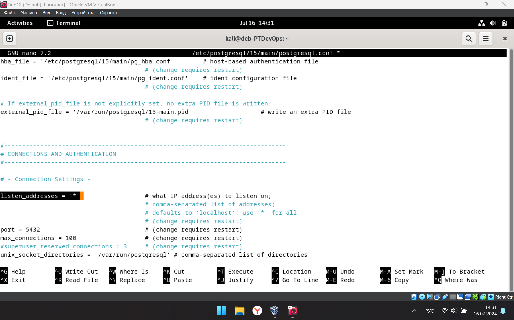
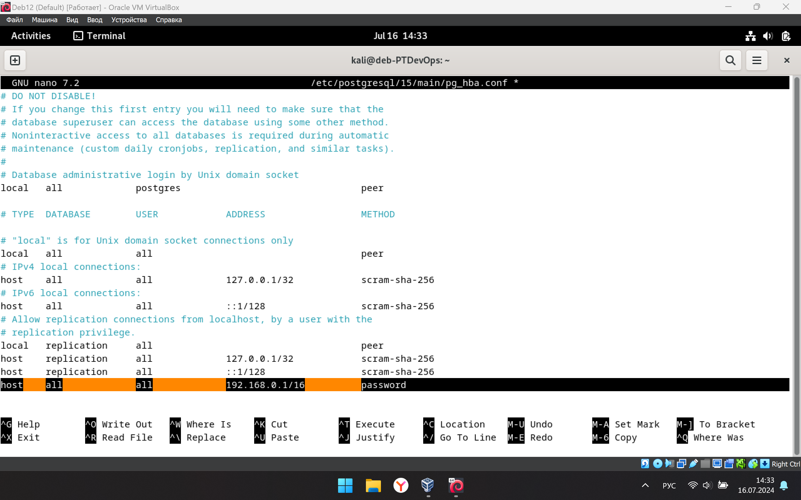
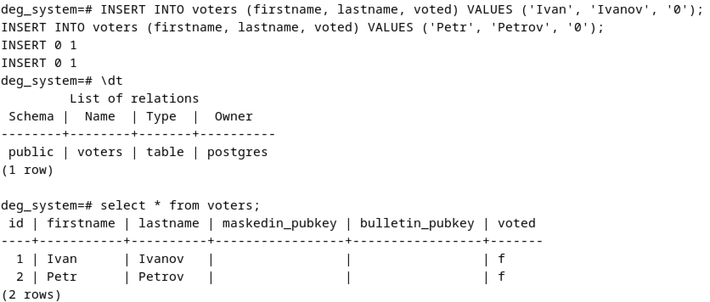

# Система дистанционного электронного голосования

# [Notion version](https://mbiuib.notion.site/193d3f90e7384a018d0a0256b3b6cebd?pvs=4)

# Теория

## **Требования к системе голосования:**

1. Участвовать в выборах могут только те легитимные пользователи, которые были предварительно включены в списки, составленные избирательной комиссией (ИК);
2. Результат голосования каждого легитимного участника должен сохраняться в тайне от всех участников процедуры голосования (в том числе от других легитимных пользователей, ИК и всех посторонних),
3. Результат голосования каждого участника должен быть правильно учтен ИК и учтен лишь единожды с сохранением анонимности избирателя, за счет нарушения связи между избирателем и его бюллетенем.
4. ИК не может сфальсифицировать результаты тех легитимных избирателей, которые не захотели (не смогли) принять участие в голосовании

## Состав системы:

1. Избиратели;
2. Избирательная комиссия;
3. Общедоступный сайт в Интернет (доска объявлений, блокчейн)

## Этапы:

1. **Инициализация:** 
    1. ИК составляет список легитимных избирателей в формате `ФАМИЛИЯ: n` и публикует его
    2. ИК генерирует открытый ($n_{ик}$, $e_{ик}$) и закрытый ($d_{ик}$) ключи, публикует открытый
    3. Избиратель генерирует открытый ($n_{изб}$, $e_{изб}$) и закрытый ($d_{изб}$) ключи, публикует открытый
2. **Создание идентификационного номера $I$ избирателем:**
    1. Избиратель находит себя и свой номер n в списке и генерирует случайный идентификационный номер $I$ — цепочку цифр длиной $l$ ($l$ такая, чтобы вероятность выбора одинакового $I$ была пренебрежимо мала).
    2. Идентификационный номер $I$ нужен для того, чтобы ИК знала, что данный избиратель имеет право на голос. В данном протоколе идентификационный номер $I$ создает избиратель и дает ИК подписать его. *Подписанный идентификационный номер – это более чем достаточный признак права на голосование.*
3. **Маскировка ИН $I$, подготавливая его к слепой подписи:**
    1. Для этого идентификационный номер $I$ умножается на маскирующий множитель m  (число [1; $n_{ик}$-1], взаимно простое с $n_{ик}$). Однако так как этот множитель нужно будет в дальнейшем «сократить», этот множитель заранее возводится в степень открытого ключа ИК — $e_{ик}$: $~~I_m = m^{e_{ик}} * I \mod n_{ик}$.
    2. Для того чтобы найти значение ИН по маскированному номеру, ИК (или сторонний наблюдатель) должна перебрать всевозможные m. Однако поскольку $n_{ик}$ является очень большим числом, время для нахождения правильного $I$ оказывается нереализуемым.
4. **Шифрование и отправка маскированного ИН:**
    1. Избиратель шифрует свой номер n и маскированный ИН $I_m$ своим закрытым ключом $d_{изб}$
    2. Отправляет сообщение в ИК, содержащее номер n (продублированный в открытом виде) и криптограмму с n и $I_m$: $~~M_1 = \Big(n, E_{d_{изб}}(n, I_m)\Big)$
    3. Если злоумышленник попытается отправить сообщение на подпись от имени одного из избирателей, то он не сможет создать подобное сообщение, так как не знает секретного ключа избирателя
5. **ИК публикует все принятые сообщения $M_1$:**
    1. ИК дешифрует криптограмму $E_{d_{изб}}(n, I_m)$ и сравнивает номер n из нее с номером n из открытой части $M_1$ для подтверждения, что сообщение действительно получено от n-го избирателя.
    2. Публикация $M_1$ необходима, чтобы знать, кто из легитимных избирателей проголосовал. Поэтому ИК не сможет воспользоваться голосами тех, кто не участвовал
6. **ИК вслепую подписывает маскированный ИН и отправляет избирателю:**
    1. Для этого ИК выполняет процедуру цифровой подписи РША: 
        
        $~~I_{sm} = I_m^{d_{ик}} \mod n_{ик}$
        
    2. Отправляет обратно избирателю
7. **Избиратель демаскирует подписанный ИН:**
    1. Демаскирует: $~~I_{s} = \frac{I_{sm}}{m} \mod n_{ик}$
    2. т.е. $\frac{I_{sm}}{m} \mod n_{ик} = I_m^{d_{ик}} * m^{-1} \mod n_{ик} =  (m^{e_{ик}})^{d_{ик}} * I^{d_{ик}} * m^{-1} \mod n_{ик} = m * I^{d_{ик}} * m^{-1} \mod n_{ик} = I^{d_{ик}} \mod n_{ик}$
    3. После этого избиратель проверяет подлинность подписи ИК: $(I^{d_{ик}})^{e_{ик}} \mod n_{ик} = I$
    4. Таким образом ИН избирателя подписан, а ИК и посторонние не знают его ИН
8. **Голосование:**
    1. Избиратель генерирует новые ключи ($e_v, n_v ~и~ d_v$) для шифрования бюллетеня
    2. Голосует (сообщение $V$)
    3. Формирует сообщение $M_2$ с числом $P$ (для удобства поиска $M_2$ на сайте) и криптограммой, содержащей изначальный идентификационный номер $I$, подписанный ИН $I_s$ и голос $V$:
        
        $M_2 = \Big(P, ~E_{d_{v}}(I, I_s, V)\Big)$
        
    4. Отправляет сообщение $M_2$ по анонимному каналу (чтобы ИК не узнал, кто послал)
    5. т.к. избиратель имеет только один подписанный ИН, то не сможет проголосовать еще раз
    6. Шифрование нужно для того, чтобы не подменили голос
9. **ИК публикует $M_2$ (в зашифрованном виде) на сайте.**
10. **Избиратели направляют в ИК ключ для расшифровки $M_2$:**
    1. Сообщение $M_3$ с числом P и открытым ключом ($e_v, n_v$) по анонимному каналу
        
        $M_3 = (P, e_v, n_v)$
        
11. **ИК публикует результаты:**
    1. ИК расшифровывает $M_2$ и учитывает голос неизвестного ей, но легитимного избирателя (т.к. есть подписанный идентификатор)
    2. Публикует на сайте результат голосования $V$ вместе с идентификатором $I$ для проверки правильности результатов

# Подготовка БД

## **postgresql.conf**:

```
listen_addresses = '*'
```



## **pg_hba.conf**:

```
	host all all 192.168.0.0/16 password
```



## Создание таблиц SQL:

```sql
CREATE TABLE voters ( id SERIAL PRIMARY KEY,
                      firstname VARCHAR(100),
                      lastname VARCHAR(100),
                      password VARCHAR(100),
                      pubkey TEXT);
INSERT INTO voters (firstname, lastname, password) VALUES ('Ivan', 'Ivanov', 'Qq123456');
INSERT INTO voters (firstname, lastname, password) VALUES ('Petr', 'Petrov', 'Qq123456');

CREATE TABLE m1 ( id INTEGER,
                  encrypt_ident_num TEXT,
                  rec_id INTEGER,
                  masked_ident_num TEXT);

CREATE TABLE votes (vote_id INTEGER,
                    encrypt_vote TEXT,
                    pubkey TEXT,
                    ident_num TEXT,
                    signed_ident_num TEXT,
                    vote TEXT);
```

